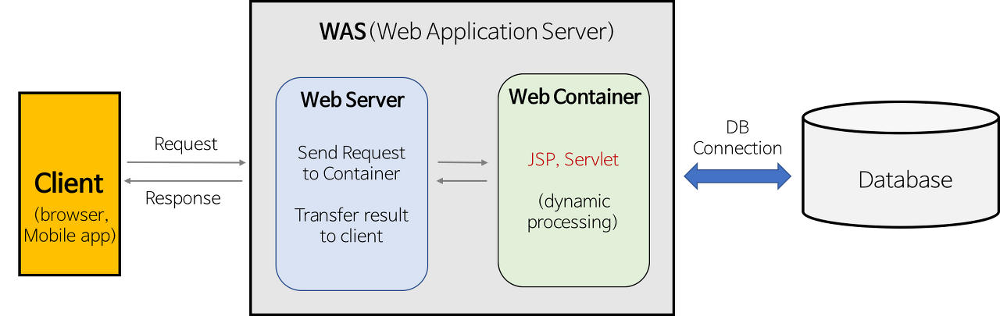

# 서버

정적페이지가 webServer의 일이라면 동적페이지는 WAS(Web Container가 동적인 소프트웨어)가 처리한다



### **Web Server 웹 서버**

**HTTP 요청을 받아 Static contents를 제공하는 서버, 프로그램**

- HTTP 프로토콜을 기반으로 하여 클라이언트의 요청을 서비스하는 기능을 담당

(Ex. Apache Server, Nignx, ...)

**기능 1**: 정적인 컨텐츠 제공

- WAS를 거치지 않고, 바로 요청한 컨텐츠를 제공할 수 있다.

**기능 2**: 동적인 컨텐츠 제공을 위한 요청 전달

- 요청을 WAS에 보내고, WAS가 처리한 결과를 클라이언트에게 전달한다.

### **WAS (Web Application Server) 웹 어플리케이션 서버**

**다양한 서버 내 알고리즘, 비즈니스 로직, DB 조회 등 클라이언트 요청에 따라 동적인 컨텐츠를 제공하는 서버, 프로그램**

- HTTP 프로토콜을 기반으로 하여 클라이언트의 요청에 따라 구현된 비즈니스 로직을 통해 동적으로 만들어진 컨텐츠를 반환

(Ex. Tomcat, JBoss, Jeus, ...) - 일종의 소프트웨어

- 데이터베이스 접속 기능, 여러 개의 트랜잭션 관리 등 수행

> 사실 의미가 조금 다양하다. WAS = Web server + Web container라는 곳도 있고, WAS = Web server와 APP 간의 미들웨어라고 하는 곳도 있고, WAS = WAS + APP 라고 해서 한번에 모든 기능을 한다고 말하는 곳도 있다. 대부분의 경우, Web server + Web container 설명하고 있으니 그렇게 이해하자.

지킬은 Template과 Contents를 등의 다양한 포맷의 텍스트 데이터를 읽어서 static websites를 생성해준다. 이를 알아듣기 쉽게 설명하면 markdown 파일을 사용하는 블로그 플랫폼이다.

## 도커


도커 이미지가 여러개의 컨테이너를 만든다

```jsx
const thunk = (store) => (next) => (action) =>
  typeof action === 'function'
    ? action(store.dispatch, store.getState)
    : next(action);

// action.type이함수일 경우,
// next()로 리듀서로 넘기지않고 그냥 함수를 dispatch,getState로 실행한다
```

## Try ~ catch 문의 오류처리

try ~ catch문은 블록 레벨의 스코프를 가지는 문이다

try 문 안에서 오류가 발생했을 때 catch문으로 이동하여 해당 오류를 처리한다

하지만, **비동기함수에서는 작동이 하지 않는다**

```jsx
try {
  setTimeout(() => {
    throw (new Error('에러를 못잡아낸다'), 2000);
  });
} catch (e) {
  console.log('에러를 해결했습니다');
}

// => Uncaught 2000
```

에러는 발생시에 함수의 호출자 방향으로 에러를 전파한다. 전파되는 에러가 상위 호출자를 못만나는 시점에서 에러를 내뱉으며 프로그램은 강제종료 된다

하지만 비동기함수는 ‘호출자’를 찾을 수 없다.

예시의 setTimeout이라는 비동기함수로 설명하자면, 실행컨텍스트 관점에서, seTimeout은 타이머함수를 콜백으로 남기고 실행 컨텍스트에서 제거된다. 후에 스택 안에 모든 함수들이 사라졌을 때 마이크로 태스크 큐에 들어있던 타이머함수(콜백함수)가 실행되는데, **그 시점에서** 더이상 호출자 함수는 없다(애초에 함수가 하나도 안 남아있으니 이벤트 루프가 실행되었겠지)

**그렇다면 비동기 함수의 오류는 어떻게 잡아줄 수 있는가?**

**Promise객체를 활용하며 된다**

```jsx
const promise = new Promise((resolve, reject)=>{
  setTimeout(()=>{
    reject("reject");
  }, 3000);
})

// 1 then.catch로 연결해나감
promise.then(result => console.log(result))
				.catch(error => console.log('에러가 해결되었습니다'));

// 2 async await로 한번 더 처리
// fetch()로 돌려진 값은 promise객체(response객체가 결과값)
// response객체를 josn()해준 promise를 받아야 한다

async test() {
	try {
	const result = await promise() // promise의 값 = await promise or 일반값
}) catch (err){
	console.log('에러가 해결되었습니다')
}
```

<aside>
💻 어렵게 생각하지마라 promise객체가 비동기 통신을 해결한다

</aside>

---

테스트하기 위해서 몇가지 항목을 첨부한다

1. 테스트 시작
2. 테스트 끝